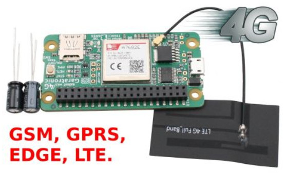
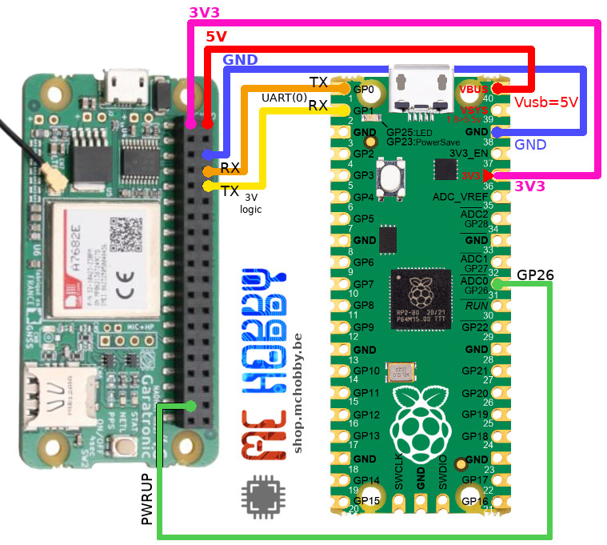

# SIMCom A7682E Modem library

MicroPython SIM76xx module based on the work [SIM7600 MicroPython Library](https://github.com/basanovase/sim7600) from basanovase.

The MicroPython library was tested and consolidated around the "[SimCom A7682E Nadhat GSM MK2 - 4G / LTE - USB et HAT](https://shop.mchobby.be/fr/hats-et-phats/2515-nadhat-gsm-mk2-4g-lte-usb-et-hat-simcom-a7682e-3232100025158-garatronic.html)" available at MCHobby and developped by [Garatronic France](https://blog.garatronic.fr/index.php/fr/).



The SimCom A7682E HAT offers great support for Raspberry-Pi nano computer either via GPIO, either via the USB interface (see microUSB connector). This HAT can also be used with microcontroler running under MicroPython like a Raspberry-Pi Pico.

The library covers:

* Connecting network,
* SMS,
* calling, _<pending>_
* phonebook, _<pending>_
* GPRS, _<pending>_
* FTP, _<pending>_
* TCP/IP and HTTP _<pending>_

## Credit 

Based on the work [SIM7600 MicroPython Library](https://github.com/basanovase/sim7600) from basanovase	

# Library


The library must be copied on the MicroPython board before using the examples.
Please note that LIBRARIAN must also be installed.

On a WiFi capable plateform:

```
>>> import mip
>>> mip.install("github:mchobby/micropython-A7682E-modem")
>>> mip.install("github:mchobby/esp8266-upy/LIBRARIAN")

```

Or via the mpremote utility :

```
mpremote mip install github:mchobby/micropython-A7682E-modem
mpremote mip install github:mchobby/esp8266-upy/LIBRARIAN
```

# Wiring

## Wiring to Pico



# Know issue

__SMS__

* Send message is sensitive to concurrent URC reception (Unsolicitated Result Code). That may occasionaly raise an exception due to response parsing issue.

# Testing

## fundamentals examples
* __[test_initial.py](examples/fundamentals/test_initial.py)__ : [VERY IMPORTANT] power up the module, check if pincode is required (and enter it), wait the SIMCom to register the network.
* __[test_control.py](examples/fundamentals/test_control.py)__ : test the 'control' sub-library (get IMEI, network access, Network Scan, RSSI, SIM serial, ....)
* __[test_notifs.py](examples/fundamentals/test_notifs.py)__ : how to use the 'update()' call to capture the URC Unsollicitated Result Code (like SMS received, RING, ...)
* __[test_pwroff.py](examples/fundamentals/test_pwroff.py)__ : soft shutdown/power_off the module with AT command
* __[test_raw.py](examples/fundamentals/test_raw.py)__ : very basic examples. The first used to test the communication with SIMCom module

## SMS examples
* __[test_delete_all.py](examples/sms/test_delete_all.py)__ : [VERY IMPORTANT] delete all the messages stored in the SIM and make room to received new SMS from the mobile network.
* __[test_delete.py](examples/sms/test_delete.py)__ : delete a stored SMS by it ID, useful to freeup the SIM memory when the SMS was received and read.
* __[test_list.py](examples/sms/test_list.py)__ : list the SMS ID for the statuses RECEIVED_UNREAD, RECEIVED_READ, UNSENT, SENT, ALL.
* __[test_read.py](examples/sms/test_read.py)__ : read a stored SMS by its ID.
* __[test_read_all.py](examples/sms/test_read_all.py)__ : list ALL IDs of the stored SMS and read the corresponding messages.
* __[test_send.py](examples/sms/test_send.py)__ : send SMS message to a phone number.
* __[test_on_notif_read.py](examples/sms/test_on_notif_read.py)__ : [VERY IMPORTANT] wait SMS notification from mobile network then read it and send a confirmation.
